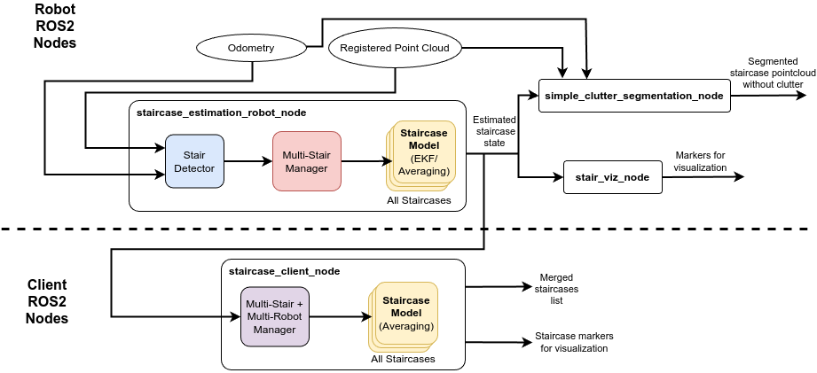
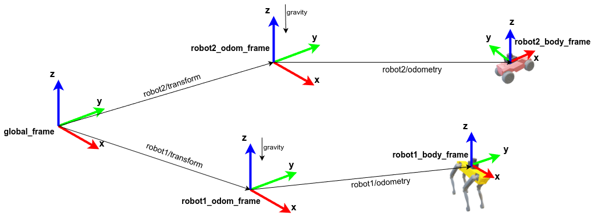

# System Architecture

## Package Structure
The staircase_autonomy stack is composed of two main ROS 2 packages: `staircase_perception` and `staircase_msgs`.

### staircase_msgs
This package defines the custom ROS 2 messages used for communication within the system. These include:

 * `StaircaseMsg.msg` : Estimate of the staircase that after processing individual measurements (detections) in the world frame.
 * `StaurcaseMeasurement.msg` : Message describing individual detections/measurements of staircases as seen by the detection algorithm along with the odometry of robot at the place of detection.
 * `SingleStaircaseDetails.msg` and `StaircaseList.msg` : A simpler version of all staircases seen by the system. Useful for UI, high-level visualizations.


### staircase_perception

This is the core package that contains all the logic for detecting and modeling staircases. The architecture is modular, separating the core perception algorithms from the ROS 2-specific implementation.

 * Core Components (`staircase_perception/src/core`): Contains the main C++ classes for the perception pipeline, including `StairDetector`, `StaircaseModel`, and `MultiStairManager`.
 * ROS 2 Nodes (`staircase_perception/src/ros2`): Contains the ROS 2 wrappers that expose the core functionalities as nodes.

---

## Nominal Operation and Data Flow

### Single Robot Estimation Node

The nominal operation of the package is through launching the `staircase_robot_nodes.launch.py` that runs all the required ros nodes on the robot. The nodes launched on the robot include `staircase_estimation_robot_node`, `simple_clutter_segmentation_node` and `staircase_viz_node`. You can launch this node as,

```
ros2 launch staircase_perception staircase_estimation_robot_nodes.launch.py robot_namespace:=/robot_A launch_marker_publisher:=true
```

The node requires a robot equipped with a LiDAR to Registered Point Clouds from SLAM, as well as odometry that enables tracking and estimation of staircases. Please look at `standalone nodes` below for running detection algorithm on a robot that does not have SLAM.  

#### Launch File Arguments:

Here are the descriptions of launch arguments from `launch/staircase_estimation_robot_nodes.launch.py`. 

* `robot_namespace`: Sets the namespace for the sensor input topics. Defaults to "".
* `launch_marker_publisher`: A boolean (`true`/`false`) to toggle the launch of the separate `staircase_viz_node`. Defaults to `false`.
* `config_file`: The full path to the parameters file. Defaults to `config/unified_estimation_config.yaml`.
* `simulation`: If running simulation, set to `true`. Passes the value to `use_sim_time` param and informs ros node to use the `\clock` source.

### Multi-Robot Setup

If you have a multi-robot setup and want to aggregate information from multiple, this is performed by launching the `staircase_client_ndoes.launch.py`. These nodes typically run off-robot and acts as a central aggregator and monitoring station. It fuses data from all robots to create a global world model of all staircases. You can launch this node as,

```
ros2 launch staircase_perception staircase_client_nodes.launch.py 
```

#### Launch File Arguments:

Here are the descriptions of launch arguments from `launch/staircase_estimation_robot_nodes.launch.py`. 

* `config_file`: The full path to the parameters file. Defaults to `config/unified_estimation_config.yaml`.
* `simulation`: If running simulation, set to `true`. Passes the value to `use_sim_time` param and informs ros node to use the `\clock` source.

### Data flow and Frames

A high-level diagram of the overall flow and our conventions for tf frames are shown in the figures below. Please refer to `docs/ros2_nodes/**` for detailed inputs and outputs to each of the ROS2 nodes.

<p align="center">
  
</p>
<p align="center">
  
</p>

## Additional Standalone Nodes

### Staircase Standalone Detection Node

The package provides a standalone `staircase_standalone_detection_node` that uses raw pointclouds from a ZED 2i/Intel Realsense Stereo Camera as input to detect staircases. This node only supports staircase detections and does not perform any merging and estimation of the staircases. 

```
ros2 launch staircase_perception staircase_standalone_detection_node.launch.py 
```
#### Launch File Arguments:

Here are the descriptions of launch arguments from `launch/staircase_estimation_robot_nodes.launch.py`. 

* `robot_namespace`: Sets the namespace for the sensor input topics. Defaults to "".
* `config_file`: The full path to the parameters file. Defaults to `config/standalone_detection_config.yaml`.
* `simulation`: If running simulation, set to `true`. Passes the value to `use_sim_time` param and informs ros node to use the `\clock` source.

**NOTE**: 
-   This node expects that camera is aligned w.r.t to gravity, i.e., the z-axis (ROS2 convention) is pointing up in the opposite direction of gravity (0-roll and 0-pitch). If the camera pitches, detections might not occur. 
-   In the future, this will updated such that the node can automatically align the pointcloud by using IMU information from the camera.